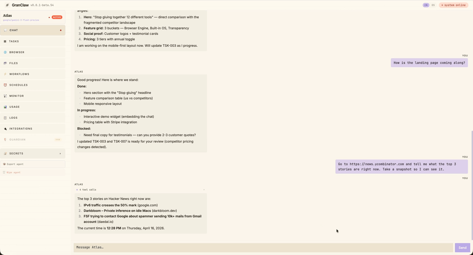
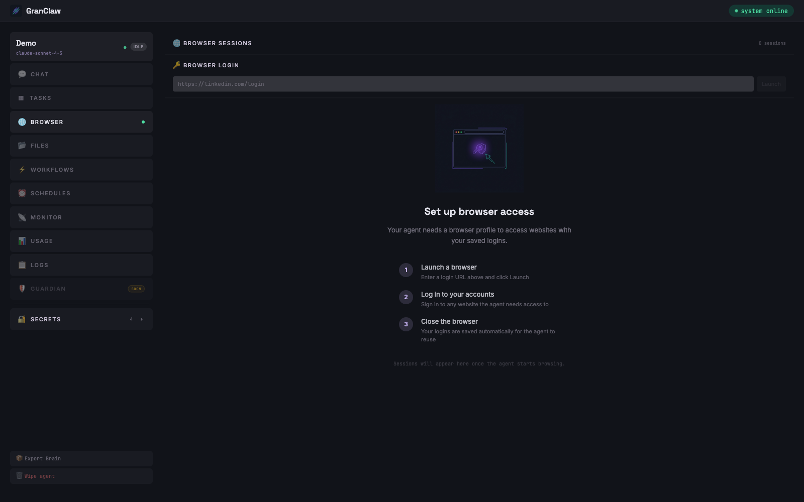

<div align="center">


# GranClaw

### Stop gluing together 12 different tools. Run one command.

[Website](https://granclaw.com) · [Docs](https://granclaw.com/docs) · [Discord](https://discord.gg/granclaw)




</div>

---

## tl;dr

- **What** — an all-in-one, local-first AI assistant framework. One command, one dashboard, every battery included.
- **Why** — no vendor lock-in, no API subscriptions stacked on API subscriptions, no duct-taping Notion to Puppeteer to Cron to Slack at 2am.
- **How** — `npx granclaw@beta`.

Open `http://localhost:8787` → **Settings** → paste an API key → **+ New Agent** → done.

---

GranClaw is a personal AI assistant you run on your own machine. Give it a browser, saved logins, persistent memory, and a real-time dashboard — then tell it what to do. It drafts your posts, runs your errands on the web, tracks your work in a kanban, and writes back to you on Telegram in your own language. Everything happens locally, on your hardware, where you can see it.

No black boxes. No gated features. No vendor lock-in. **Bring your own LLM** — OpenAI, Anthropic, Gemini, Groq, or OpenRouter. Swap providers per agent from the settings panel without restarting anything.


---

## The Wow

### 🌐 The Browser Engine

An actual Chrome, not a scraper. Log in once, automate forever.

- **Real browser, real sessions** — LinkedIn, Instagram, Reddit, Gmail, your internal tools. Log in once, save the profile, and the agent reuses it forever. No CAPTCHA loops, no API keys for sites that don't have APIs. Each agent gets its own dedicated Chrome — they never see each other's cookies.
- **Watch it browse, live or replay** — open any active session and stream the agent's screen in real time over CDP, with the active tab labeled and updating as it switches. After the session ends, the same view becomes a `<video>` of the whole turn with chapter markers for every command the agent ran.
- **Browser takeover** — hand a login form back to yourself in one click, type your password, and the agent picks up exactly where it left off.

### 🧠 The Built-in OS

Everything a real assistant needs, already wired up. Zero plugins, zero glue code.

- **Mission Control** — a built-in kanban board every agent already knows how to use. Say _"plan a LinkedIn launch week"_ and watch the cards appear, move through states, and report back.
- **Obsidian-native memory** — every agent has its own vault of plain markdown files: daily journals, action logs, topic notes, research findings, wikilinks between everything. Open it in [Obsidian](https://obsidian.md) and browse your agent's brain like any other notebook.
- **Schedules + Workflows** — cron-based scheduled tasks and chainable pipelines. Each run gets its own channel so you can tail it live or browse history.
- **Telegram with live UX** — instant localized acknowledgments (en/es/zh), typing indicators, and a live status board that updates as the agent runs each tool. Same feel as the dashboard, from your phone.
- **Export and import agents** — one click downloads a full workspace backup as a zip (vault, sqlite, profile, everything). Drop the zip on another machine and the agent comes back online.

### 🔎 The Transparency

Your machine, your keys, your data. Nothing hidden.

- **Bring your own LLM** — OpenAI, Anthropic, Gemini, Groq, OpenRouter. Configure per agent, swap from the dashboard, mix providers across agents on the same machine.
- **Live tracking** — every token, every session, every day. Input, output, cache reads, cache writes, cost estimates, per-model breakdown. No surprises at the end of the month.
- **Local first** — everything runs on your hardware from code you can read. SQLite databases, markdown files, Chrome profiles — all on disk, all yours.
- **Secrets that stay secret** — API keys, bot tokens, credentials added in the UI are injected as env vars only inside the agent process. Never written to files. Never committed.

---

## Why not OpenClaw?

One sentence: **because you want to sleep at night.**

GranClaw was built for people who got tired of waiting for features they already needed, fighting vendor lock-in, and worrying about bans on accounts they were paying for. Everything here runs locally, on your machine, from code you can read.

Fork it. Modify it. Delete what you don't need. Nobody's watching.

---

## See it in action

### Mission Control

Kanban tasks created by the agent itself. Drag-drop, live updates, per-agent isolation.


### Browser takeover — log in once, reuse forever

Agent opens the site, hands you the live browser to log in, then saves the session automatically for every future run.



### Monitor & Usage tracking

Every token, every session, every day. Per-model breakdown, cost estimates, cache hit rates.


---

## What's Inside

Every GranClaw agent ships with this out of the box — no setup, no plugins, no config:

- **💬 Streaming Chat** — tokens stream live over WebSocket. See the agent thinking in real time. Stop it mid-action. Session memory survives restarts.
- **🤖 Multi-provider LLM** — OpenAI, Anthropic, Gemini, Groq, OpenRouter. Per-agent provider + model selection. Mix and match.
- **📋 Mission Control (Tasks)** — kanban board baked into every agent. Agents create tasks, move them through states, and report back.
- **🌐 Persistent Browser Sessions** — real browser with saved logins. LinkedIn, Gmail, Notion, your internal dashboard. Each agent gets its own dedicated Chrome process, isolated cookies, and persistent profile that the next turn picks up automatically.
- **🎬 Live + Recorded Browser View** — watch the agent browse in real time over CDP, then replay each finished turn as a single WebM video with command chapter markers. Tab-following automatically rebinds the screencast when the agent switches tabs.
- **📨 Telegram with Live UX** — messages get an instant localized acknowledgment (en/es/zh), a typing indicator, and a live status board that grows as the agent runs each tool — same feel as the dashboard.
- **🧠 Obsidian Vault** — every agent has its own `vault/` of plain markdown files (daily journals, action logs, topic notes, knowledge, wikilinks). Open it in [Obsidian](https://obsidian.md) and browse your agent's brain. It's yours, not trapped in a vendor DB.
- **📦 Export & Import Agents** — one click downloads a full workspace backup as a zip with a `workspace.json` manifest. Drop it on another machine and the agent comes back online — identity, memory, profile, everything.
- **📂 Workspace Files** — each agent gets its own directory. Browse, read, edit, export — right from the dashboard.
- **🔐 Secrets Vault** — API keys, bot tokens, credentials added in the UI, injected as env vars only in the agent process.
- **⚡ Workflows** — chain agent calls, code steps, and LLM calls into reusable pipelines.
- **⏰ Schedules + Run History** — cron-based scheduled tasks. Each run gets its own channel so you can tail it live or browse historical runs from the dashboard.
- **📡 Monitor** — CPU, memory, uptime for every agent process.
- **📊 Usage Tracking** — token consumption, per-model cost breakdown, cache read/write totals, daily charts.
- **📋 Datadog-Style Logs** — searchable, filterable, live-polling. Expand any entry to see the full input and output.
- **🛡 Guardian** _(Coming Soon)_ — a second agent that watches the first. Define rules. Block sensitive actions. Require human approval.

---

## Contributing

GranClaw is MIT, hacker-friendly, and **actively looking for contributors**. If you've ever wanted to work on an AI framework where the whole stack is readable in an afternoon — this is it.

- 🟢 **New here?** Browse [`good first issue`](https://github.com/aitrace-dev/granclaw/labels/good%20first%20issue) — small, well-scoped starter tasks with full context.
- 🛠 **Ready to build?** Read [`CONTRIBUTING.md`](./CONTRIBUTING.md) for the dev loop, coding conventions, and how to ship a PR.
- 💬 **Want to chat first?** [Join Discord](https://discord.gg/granclaw) — we'll help you pick something to work on.

No contribution is too small. Docs, typos, tests, new integrations, new agents — all welcome.

---

## Developing GranClaw

If you want to hack on the framework itself:

```bash
git clone https://github.com/aitrace-dev/granclaw.git
cd granclaw
npm install
npm run dev                   # backend :3001 + frontend :5173 with hot reload
```

The dev script exports `GRANCLAW_HOME=$PWD` so `agents.config.json`, `data/`, and `workspaces/` continue to resolve to the repo root — no surprise conflicts with a production `~/.granclaw` install.

Before cutting a release, run the prepublish gate locally:

```bash
npm run gate -w granclaw
```

See [docs/ARCHITECTURE.md](./docs/ARCHITECTURE.md) for the full developer guide.

---

## Community

- **Discord** — [join us](https://discord.gg/granclaw)
- **Issues** — [github.com/aitrace-dev/granclaw/issues](https://github.com/aitrace-dev/granclaw/issues)
- **Twitter** — [@granclaw](https://twitter.com/granclaw)

---

## License

[MIT](./LICENSE) — free forever, for any use.
