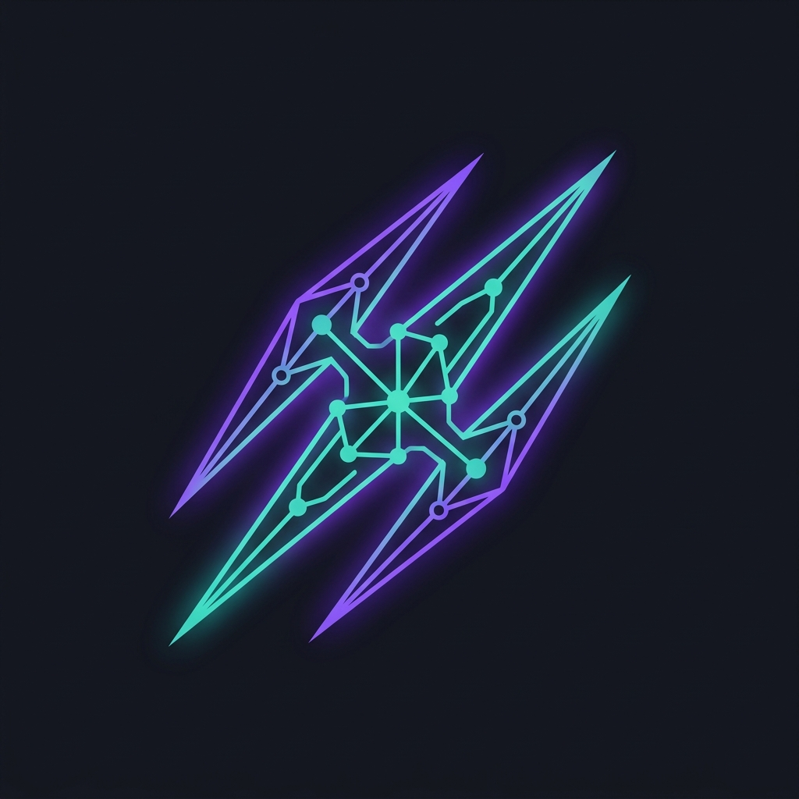
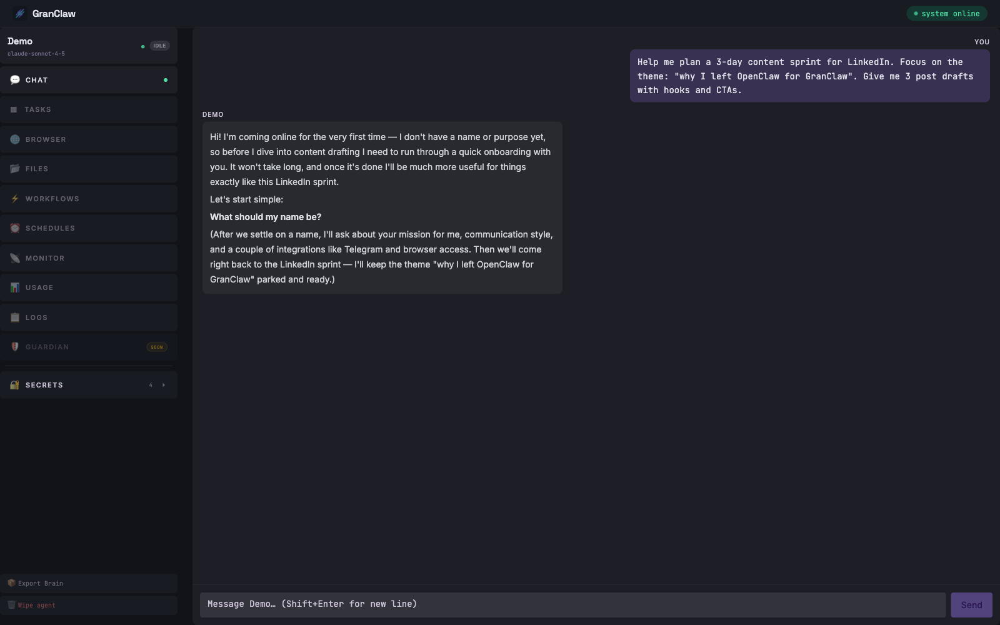
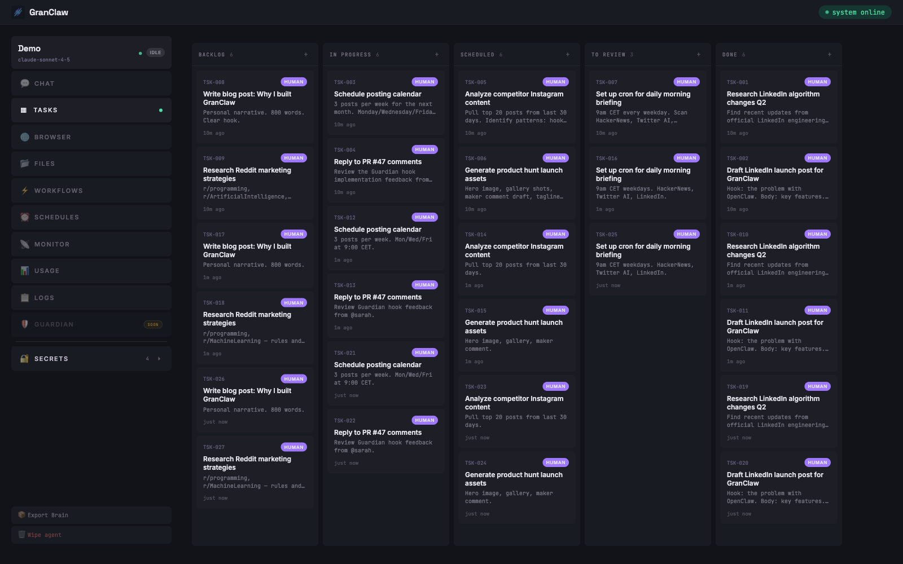
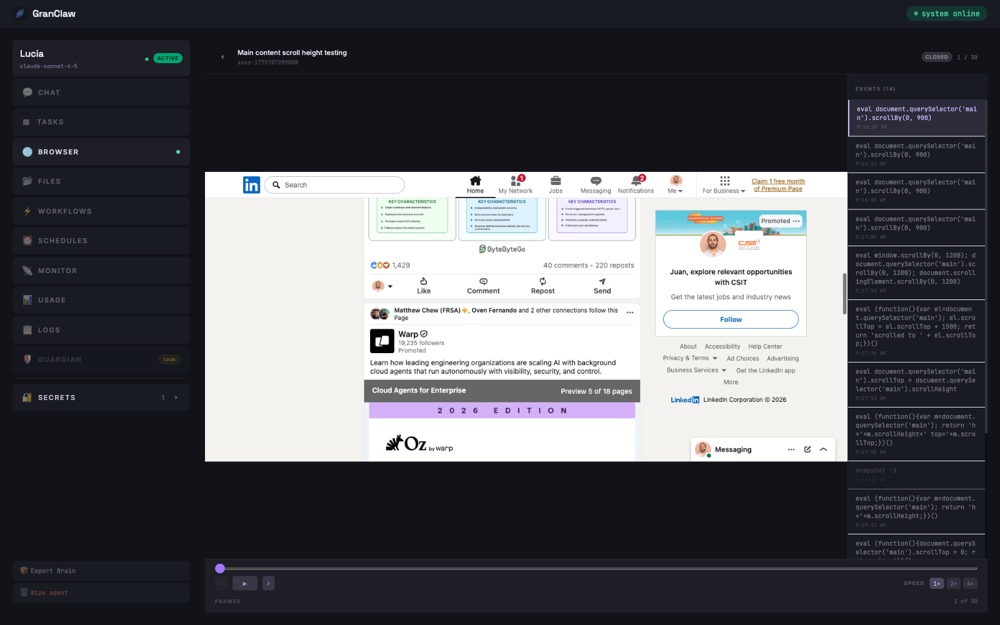
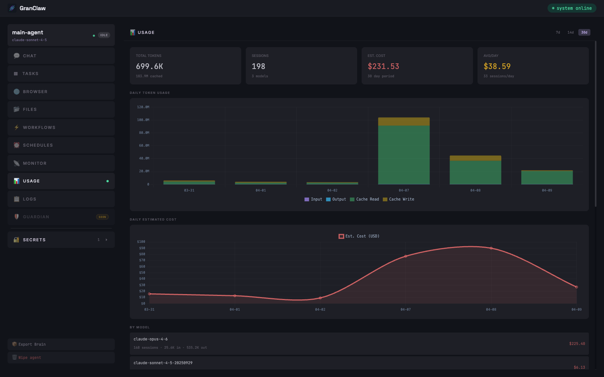

<div align="center">



# GranClaw

### Everything you wanted in OpenClaw. In one place. With Claude Code.

[Website](https://granclaw.com) · [Docs](https://granclaw.com/docs) · [Discord](https://discord.gg/granclaw)


</div>

---

GranClaw is a personal AI assistant you run on your own machine. Give it a browser, saved logins, persistent memory, and a real-time dashboard — then tell it what to do. It drafts your posts, runs your errands on the web, tracks your work in a kanban, and writes back to you on Telegram. Everything happens locally, on your hardware, where you can see it.

No black boxes. No gated features. No surprise bans. Built on **Claude Code** — the CLI you already pay for, not the API.



---

## The Wow

- **Mission Control** — a built-in kanban board every agent already knows how to use. Say _"plan a LinkedIn launch week"_ and watch the cards appear, move through states, and report back. Zero configuration.

- **Real browser, real sessions** — LinkedIn, Instagram, Reddit, Gmail, your internal tools. Log in once, save the profile, and the agent reuses it forever. No CAPTCHA loops, no API keys for sites that don't have APIs.

- **Watch it browse** — every page, every click, every scroll. Click any session and you get a timeline of screenshots plus the exact DOM commands the agent ran.

- **Secrets that stay secret** — API keys, bot tokens, credentials added in the UI are injected as env vars only inside the agent process. Never written to files. Never committed.

- **Claude Code first** — runs on your Claude Code subscription, the same CLI you use every day. No API billing. No rate-limit terror. No risk of account action for "unusual usage" — because it *is* usual usage.

- **Know what you're spending** — every token, every session, every day. Cost estimates, cache hit rates, per-model breakdown. No surprises at the end of the month.

---

## See it in action

### Mission Control

Kanban tasks created by the agent itself. Drag-drop, live updates, per-agent isolation.



### Browser session replay

Every browser session the agent runs is recorded — screenshots + the exact DOM commands it ran. Scrub through the timeline, see what the agent clicked, what loaded, what it read.



### Usage tracking

Every token, every session, every day. Per-model breakdown, cost estimates, cache hit rates.



---

## Quick Start

```bash
git clone https://github.com/aitrace-dev/granclaw.git
cd granclaw
npm install
npm run dev
```

Open `http://localhost:5173` → **+ New Agent** → done.

**Prerequisites:** Node 20+, the `claude` CLI on your PATH ([Claude Code](https://claude.ai/download)).

---

## What's Inside

Every GranClaw agent ships with this out of the box — no setup, no plugins, no config:

- **💬 Streaming Chat** — tokens stream live over WebSocket. See the agent thinking in real time. Stop it mid-action. Session memory survives restarts.
- **📋 Mission Control (Tasks)** — kanban board baked into every agent. Agents create tasks, move them through states, and report back.
- **🌐 Persistent Browser Sessions** — real browser with saved logins. LinkedIn, Gmail, Notion, your internal dashboard — anything that runs in a browser.
- **📂 Workspace Files** — each agent gets its own directory. Browse, read, edit, export. Your agent's knowledge is yours.
- **🔐 Secrets Vault** — API keys, bot tokens, credentials added in the UI, injected as env vars only in the agent process.
- **⚡ Workflows** — chain agent calls, code steps, and LLM calls into reusable pipelines.
- **⏰ Schedules** — cron-based scheduled tasks. Agent wakes up at 9am, writes you a summary, goes back to sleep.
- **📡 Monitor** — CPU, memory, uptime for every agent process.
- **📊 Usage Tracking** — token consumption, per-model cost breakdown, daily charts.
- **📋 Datadog-Style Logs** — searchable, filterable, live-polling. Expand any entry to see the full input and output.
- **🛡 Guardian** _(Coming Soon)_ — a second agent that watches the first. Define rules. Block sensitive actions. Require human approval.

---

## Why not OpenClaw?

One sentence: **because you want to sleep at night.**

GranClaw was built for people who got tired of waiting for features they already needed, fighting vendor lock-in, and worrying about bans on accounts they were paying for. Everything here runs locally, on your machine, from code you can read.

Fork it. Modify it. Delete what you don't need. Nobody's watching.

---

## Community

- **Discord** — [join us](https://discord.gg/granclaw)
- **Issues** — [github.com/aitrace-dev/granclaw/issues](https://github.com/aitrace-dev/granclaw/issues)
- **Twitter** — [@granclaw](https://twitter.com/granclaw)

---

## License

[MIT](./LICENSE) — free forever, for any use.
